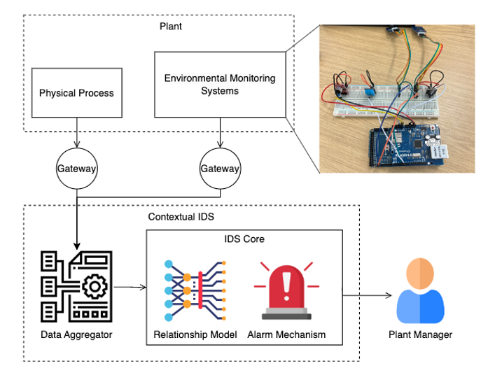
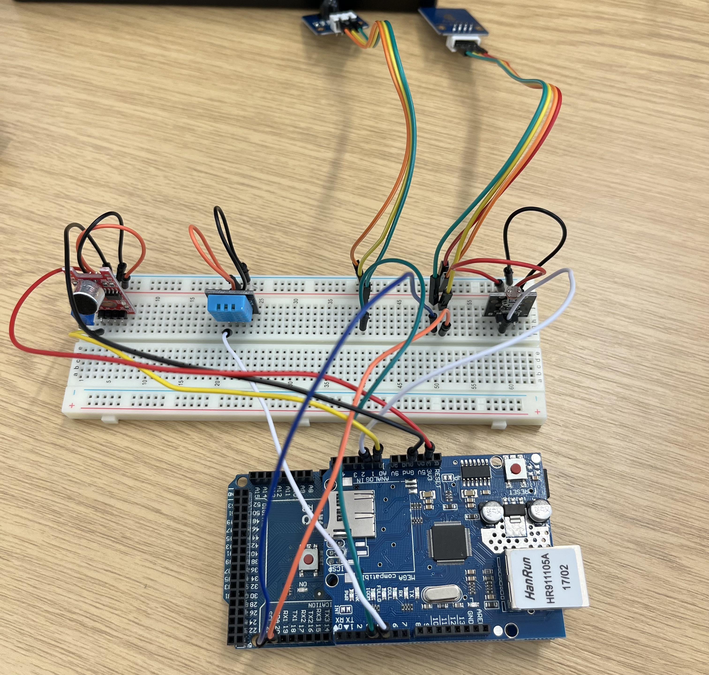

# Contextual IDS for a Plant

## Intro

This project introduces a Contextual IDS specifically designed for industrial plants, which integrates both the plant environment and physical processes. By leveraging an Arduino-based Environmental Monitoring System, the IDS collects real-time data on key environmental parameters such as temperature, humidity, vibration, light, sound, and motion. This data, combined with machine learning and deep learning techniques, enables the development of robust anomaly detection models. These models can identify deviations from normal operation, signaling potential cyber-attacks or operational faults.

The Contextual IDS aims to provide a deployable solution that can be seamlessly integrated into production environments, offering real-time monitoring and anomaly detection capabilities. This project not only addresses the growing need for cybersecurity in industrial settings but also contributes to the broader field of industrial automation by enhancing the resilience and reliability of critical infrastructure.

## Environmental Monitoring Systems

sensors used

| Sensor     | Parameters            |
| :--------- | :-------------------- |
| DHT 11     | Temperature, Humidity |
| BMP 085    | Temperature, Pressure |
| MPU 6050   | Accelerometer         |
| KY 037     | Sound                 |
| LM 393     | Light                 |
| SW 420     | Vibration             |
| PIR Sensor | Movement              |

## Deliverables

This project proposes a new Contextual IDS architecture based on the plant environment and physical process, containing the following key deliverables:

- [x] **An Arduino-based Environmental Monitoring System**: This system for industrial use can collect real-time data on temperature, humidity, vibration, light, sound, and etc.

- [ ] **Anomaly Detection Model**: A model trained using collected data from physical processes and the Environmental Monitoring system through deep learning.
- [ ] **Deployable IDS**: An IDS that can be implemented in production environments for anomaly detection.
